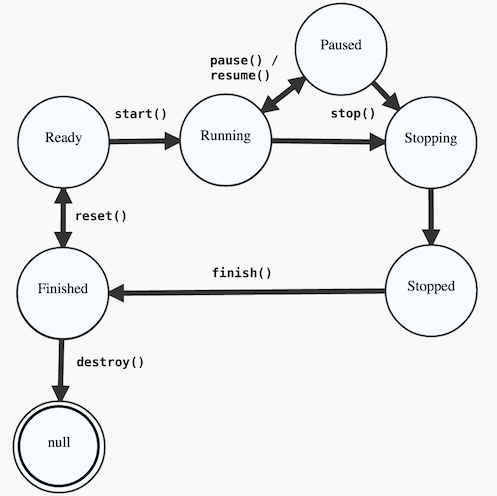

# JState (v3.0) [](https://travis-ci.org/UnquietCode/JState)
A core Java tool which provides state machine semantics using enums, strings, or anything else you
want to represent the various states. States have transitions which can move them to other states.
Callbacks are provided for transitions, and for each state when entering or exiting. It is also
possible to route a transition request based on your own logic. You can even provide a callback
which will fire when a sequence of states is matched.

All of the methods which modify, transition, or inquire about the state are synchronized, allowing
multiple threads access to the same state machine. However, to avoid unpredictable behavior, it is
generally better to construct your state machine up front and not modify it thereafter. The
EnumStateMachine and StringStateMachine in particular can be serialized to and from their string
representations.

As of version 3.0, the minimum version of Java required is JDK 8.

# Installation
The project is built using Maven, and the artifacts are available from Maven Central. (If you
are a current user of the tool, note that the group name has been recently changed to
accommodate Sonatype's repository hosting requirements.)
```
<dependency>
    <groupId>com.unquietcode.tools.jstate</groupId>
    <artifactId>jstate</artifactId>
    <version>3.0</version>
</dependency>
```

[Javadocs Link](http://www.javadoc.io/doc/com.unquietcode.tools.jstate/jstate/3.0)

# Usage
A typical use case might be a state machine for controlling a process, which can move between the
states [`Ready`, `Running`, `Paused`, `Stopping`, `Stopped`, `Finished`].



After declaring a state enum we can set up a new state machine as follows:

```java
enum State {
    Ready, Running, Paused, Stopping, Stopped, Finished
}

...

EnumStateMachine<State> esm = new EnumStateMachine<>(State.Ready);
esm.addTransitions(State.Ready, State.Running, State.Finished);
esm.addTransitions(State.Running, State.Paused, State.Stopping);
esm.addTransitions(State.Paused, State.Running, State.Stopping);
esm.addTransitions(State.Stopping, State.Stopped);
esm.addTransitions(State.Stopped, State.Finished);
esm.addTransitions(State.Finished, State.Ready, null);

esm.transition(State.Running);
```

The initial state is set either in the constructor or the `setInitialState(...)` method. The `addTransition(...)`
method supports mapping from 1..n states. In the example above, we see that some states can move to more than
one other states. The `null` state is also a possibility, depending on your preference.

Callbacks can be added as transitions are defined, and fire during transition between states:
```java
TransitionHandler<State> cb = new TransitionHandler<>() {
    public void onTransition(State from, State to) {
        // ....
    }
};

esm.addTransitions(cb, State.Ready, State.Running);
```

Callbacks can also be added on entering or exiting a state.
```java
esm.onEntering(State.Running, new StateHandler<State>() {
	public void onState(State state) {
		entered.incrementAndGet();
	}
});

esm.onExiting(State.Running, new StateHandler<State>() {
	public void onState(State state) {
		exited.incrementAndGet();
	}
});
```

`StateRouters` allow you to 'deflect' or 'redirect' a transition based on your own custom logic.
There are several pre-defined routers available which provide round-robin and randomized routing.
```java
esm.routeBeforeEntering(TestStates.Three, new StateRouter<TestStates>() {
	public TestStates route(TestStates current, TestStates next) {
		return TestStates.Two;
	}
});
```

`SequenceHandlers` are callbacks which are triggered whenever the specified sequence of states
occurs in the state machine.
```java
final List<Color> _pattern = Arrays.asList(Color.Blue, Color.Green, Color.Orange);

sm.onSequence(_pattern, new SequenceHandler<Color>() {
	public void onMatch(List<Color> pattern) {
		// pattern equals [Blue, Green, Orange]
	}
});
```

There is also support for wildcard matching in sequences, available through the use
of the `PatternBuilder` class.
```java
final Pattern<Color> _pattern = PatternBuilder.<Color>create()
	.add(Color.Red, Color.Blue)
	.addWildcard()
	.add(Color.Green)
.build();

sm.onSequence(_pattern, new SequenceHandler<Color>() {
	public void onMatch(List<Color> pattern) {
		// pattern equals [Red, Blue, Purple, Green]
	}
});
```

A special form of `StringStateMachine` (which uses strings as states) is available as the `ReflectiveStateMachine`.
This flavor allows you to declare your callbacks as methods of the state machine class. The arguments are flexible, matching the standalone callback
method's signature and allowing you to skip parameters you don't care about.
```java
ReflectiveStateMachine sm = new ReflectiveStateMachine() {

	// (optional method to declare transitions inline)
	protected void declareTransitions() {
		addTransition(null, "blue");
		addTransition("blue", "green");
		addTransition("green", null);
	}

	public void onEnteringBlue(String state) {
		enteringBlue.incrementAndGet();
	}

	public void onExitingBlue() {
		exitingBlue.incrementAndGet();
	}

	public void onGreen() {
		enteringGreen.incrementAndGet();
	}

	public void onEntering() {
		enteringAny.incrementAndGet();
	}

	public void onExiting() {
		exitingAny.incrementAndGet();
	}

	public void onTransition() {
		transitionAny.incrementAndGet();
	}
};

sm.transition("blue");
sm.transition("green");
sm.transition(null);
```


See the [tests](src/test/java/unquietcode/tools/esm)
for more usage examples, as well as the provided javadocs.

# License
JState is licensed under the MIT license. Go wild.

# Questions / Comments / Feedback
Send an email to blouis@unquietcode.com
  
Peace, love, and code.

# Thanks!
